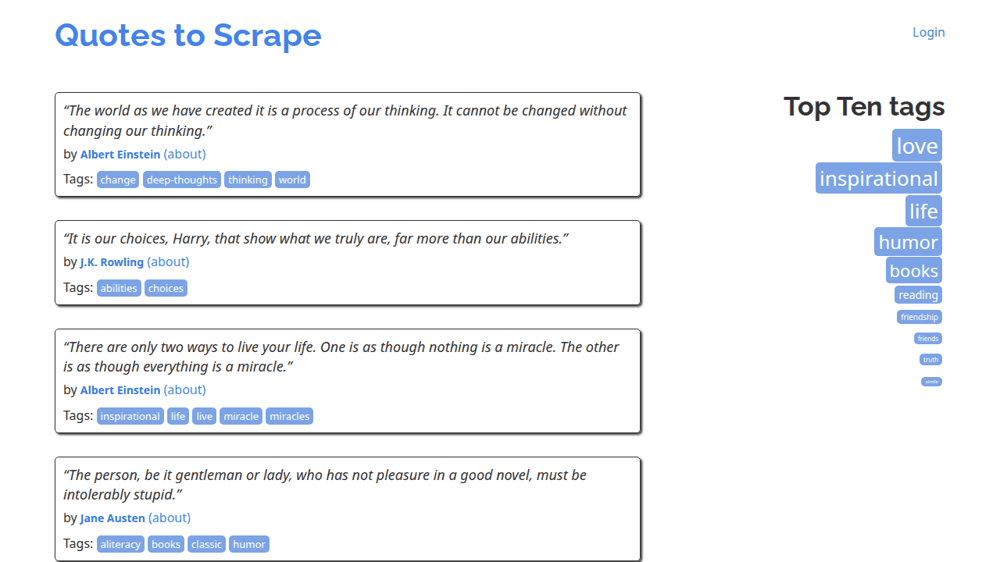

# polyfetch-scrape

> HTTP scraping toolkit: one typed `fetch()` over a reactive httpx → curl_cffi → Patchright fallback chain — TLS/JA3 impersonation, JS rendering, screenshots + interactive browser sessions, and a typed error taxonomy behind a single `Response`.

[](LICENSE)
[](CHANGELOG.md)
[](https://github.com/qte77/polyfetch-scrape/actions/workflows/test.yml)
[](pyproject.toml)
[](https://www.codefactor.io/repository/github/qte77/polyfetch-scrape)
[](https://github.com/astral-sh/ruff)

## What

- **One call, typed result.** `fetch(url)` returns a typed `Response` (`status`, `body`, `backend`, …) no matter which backend succeeded — you never pick a scraping tool per site.
- **Three-tier fallback, reactive.** `httpx` → `curl_cffi` (Chrome TLS/JA3 impersonation) → Patchright (headless Chromium, anti-detection). Escalates only on a real `403` or TLS block, so the cheap tier is always tried first — or pin one tier / bound the range with `tier` / `min_tier` / `max_tier`.
- **Handles TLS-fingerprint blocks, not just UA checks.** Real TLS/JA3 impersonation plus a headless-Chromium fallback reach sites that reject header-only spoofing ([empirical findings](docs/scraping-landscape.md)).
- **Typed error taxonomy.** Terminal statuses (`401/407/404/410/451`) raise typed exceptions; `429/5xx` retry honouring `Retry-After`.
- **Conditional GET + deep render controls.** `etag`/`last_modified` for `304`s; on the browser tier: waits, single + named screenshots, scripted actions, an interactive multi-step `render_session`, device/locale/colour-scheme emulation with optional video recording (VP8 `.webm` → `Response.video_path`), and **DevTools capture** — console messages, network failures, and uncaught JS errors (opt-in on `fetch`, always-on in `render_session`, or wire your own `page.on(...)` listeners).
- **POST bodies + polite throttling.** Send `json`/`content` request bodies (httpx/curl tiers); pass a per-host `Throttle` to stay under published rate limits.
- **Structured-first discovery.** `discover(url)` (and `polyfetch discover`) reports the cheaper-than-HTML entrypoints a site exposes — sitemaps, RSS/Atom/iCal feeds, `llms.txt`, JSON-LD `@type`s — so consumers parse structured data instead of scraping HTML.
- **Library, CLI, or env-borrow.** `import fetch`, run `polyfetch`, or sideload from another repo/agent without installing ([USING.md](USING.md)).

<!-- markdownlint-disable MD033 -->
<details>
<summary>Screencast — polyfetch's <code>render_session</code> driving a headless browser through a live site: browse pagination → open the login form → fill and submit → land logged-in (one frame per step)</summary>

<picture>
  
</picture>

Regenerate with `make screencast` ([`examples/navigate_screencast.py`](examples/navigate_screencast.py)) — uses only the public `render_session` API.

</details>
<!-- markdownlint-enable MD033 -->

## Two layers: engine + scripting substrate

polyfetch is two things behind one install:

1. **The engine** — the supported, stable, typed surface: `fetch(url) -> Response` (the reactive fallback chain), `render_session(url)` (managed multi-step browser sessions), and `discover(url)`. Most callers only ever touch this.
2. **A scripting substrate** — for flows the engine does not express directly, `render_session(url)` hands you the live, instrumented stealth-Patchright `Page` as `.page` to drive yourself, with the full Chromium **DevTools/CDP surface**: live console / network / JS-error capture (`page.on("console", …)` and friends), multi-step walks, `page.locator(...).aria_snapshot()`, post-hoc `page.set_viewport_size(...)`, ad-hoc DOM reads. polyfetch owns the browser install, launch/teardown, capture, and SSRF guard; you own the app-specific steps. The scripts under [`examples/`](examples/) show the pattern — they are examples, not part of the stable API.

**Where the line falls:** options fixed at browser/`new_context()` time — device emulation, locale, recorded video, user-agent — belong to the engine as core render options; anything *after* the page exists — clicks, screenshots, `set_viewport_size`, `aria_snapshot` — is scriptable on `.page`. (Viewport and colour scheme sit on the seam: set them once as options, or change them live on `.page`.)

## How

**I am a:** [Library user](#library) | [CLI user](#cli) | [Script author](#two-layers-engine--scripting-substrate) | [Agent / sideload](USING.md) | [Contributor](#development)

### Install

```bash
uv add polyfetch-scrape
uv run patchright install chromium   # one-off; required only for the patchright tier
```

### Library

```python
from polyfetch_scrape import fetch

r = fetch("https://nowsecure.nl/")
print(r.status, r.backend, len(r.body))     # 200 curl_cffi 179447
```

### CLI

```bash
polyfetch fetch https://example.com
polyfetch fetch https://example.com --json
polyfetch fetch https://httpbin.org/user-agent --show-body   # verify the UA you send
polyfetch fetch https://example.com --etag '"abc123"'   # conditional GET (If-None-Match → 304 on match)
polyfetch fetch https://quotes.toscrape.com/js/ --tier patchright   # force the JS-render tier
polyfetch fetch https://example.com --max-tier curl_cffi   # cap escalation — never launch a browser
polyfetch fetch https://quotes.toscrape.com/js/ --tier patchright --screenshot viewport --screenshot-out shot.png   # render + screenshot
polyfetch bulk urls.txt --workers 4 --delay 0.5   # 4 workers, ≥0.5s between same-host requests
polyfetch discover https://example.com --json   # structured entrypoints: sitemaps/feeds/llms.txt/JSON-LD
polyfetch --help
```

**Consuming polyfetch from another project or an agent without installing it?** See [`USING.md`](USING.md) — the `uv run --directory` env-borrow contract (no venv poison).

### Fallback chain

| Tier | Backend | When it engages |
|---|---|---|
| 1 | `httpx` | every request first |
| 2 | `curl_cffi` (chrome impersonation) | tier 1 returns 403 or hits a TLS error |
| 3 | Patchright (headless Chromium) | tier 2 also blocked |

`Response.backend` reflects which tier succeeded. `make demo_tiers` drives each backend directly to show what its tier uniquely provides (a TLS/JA3 fingerprint diff + a JS render); [`examples/fallback-tier-targets.txt`](examples/fallback-tier-targets.txt) lists ToS-safe targets per tier difficulty — run the ladder with `make probe_bulk FILE=examples/fallback-tier-targets.txt`.

### Public API

`fetch(url, *, …) -> Response` plus `render_session(url)` (managed multi-step interactive browser sessions), `RenderOptions`, `RenderAction`, `Screenshot`, `Response`, `RetryPolicy`, and the `FetchError` exception hierarchy. **Full signatures and options: [`docs/api-reference.md`](docs/api-reference.md).**

### Development

See [`CONTRIBUTING.md`](CONTRIBUTING.md) for the full command reference, dev workflow, and pre-commit checklist. Quick start: `make setup_dev && make validate`. For AI-agent behavioural rules, see [`AGENTS.md`](AGENTS.md); for release notes, [`CHANGELOG.md`](CHANGELOG.md).

### Versioning

Two-step release pipeline (GitHub Actions), mirroring the qte77 sibling repos:

1. **Bump** — run the **Bump version** workflow (`workflow_dispatch`; pick major/minor/patch). It bumps `pyproject.toml`, the `uv.lock` self-reference, and the README badge via [`bump-my-version`](https://github.com/callowayproject/bump-my-version), then collects the `changelog.d/` fragments into a dated `CHANGELOG.md` section via [`scriv`](https://scriv.readthedocs.io/), and opens a `chore(release)` PR.
2. **Tag + release** — **merge that PR with a PAT** (a `GITHUB_TOKEN` push won't re-trigger workflows). The **Tag and Release** workflow then tags `vX.Y.Z` on the merge commit and publishes the GitHub Release from the matching `CHANGELOG.md` section.

Per PR, add a changelog fragment (`make changelog_new`) instead of editing `CHANGELOG.md` — the bump collects them into the release section.

## Why

Claude Code's built-in **WebFetch** exposes no header parameters in its public schema, so callers cannot set `User-Agent`, `Accept`, or `Referer` — and its default UA is empirically rejected (HTTP 403) by sites with non-trivial bot detection (`hamiltoncompany.com`, `thingiverse.com`, `web.archive.org`). Header spoofing alone often isn't enough: many blocks key on the TLS/JA3 fingerprint, not the UA string. `polyfetch-scrape` is the next rung — browser-shape headers in the cheap tier, real TLS impersonation in the middle tier, and headless Chromium with anti-detection patches as the fallback — escalating only when a tier is actually blocked.

## How it compares

| Instead of… | polyfetch gives you |
|---|---|
| `httpx` / `requests` alone | the same simple call, plus automatic TLS impersonation and a browser fallback when a site blocks the plain client |
| `curl_cffi` / `cloudscraper` alone | TLS impersonation *and* a real headless browser behind one typed `Response` — no manual tier-picking |
| raw Playwright / Patchright | the browser install, launch/teardown, capture, retries and SSRF guard already wired; drop to `.page` only when you need to |
| a hosted scraping API | a dependency you run in-process: no per-request cost, no data leaving your machine, no vendor account |

Each row is a trade-off, not a claim of superiority. See the [scraping landscape](docs/scraping-landscape.md) for dated, empirical probes.

## What it does not do

Two kinds of "no":

- **Out of scope** (use a dedicated tool): proxy / residential-IP rotation, LLM-ready HTML→markdown extraction, a hosted/managed scraping service, and domain API wrappers (arXiv, patents, …) — those belong in downstream packages that consume `fetch()`.
- **Not in the engine, but scriptable today** on `render_session().page`: accessibility snapshots (`aria_snapshot`), multi-step interactive walks, ad-hoc element screenshots, and live `set_viewport_size` — a few lines on the `.page` hatch rather than a core knob (see [Two layers](#two-layers-engine--scripting-substrate)).

## References

- [Public API reference](docs/api-reference.md) — full signatures for `fetch`, `RenderOptions`, `Response`, `RetryPolicy`, and the exception hierarchy
- [Scripting cookbook](docs/scripting.md) — worked `render_session().page` recipes (DevTools capture, aria_snapshot, walks, live emulation)
- [Using without installing](USING.md) — call polyfetch from another repo/agent via `uv run --directory` (env-borrow contract: invocation, JSON schema, errors, stable surface)
- [Architecture](docs/architecture.md) — fallback-chain data flow, component responsibilities, invariants
- [Roadmap](docs/roadmap.md) — delivery history + core directions ahead
- [User stories](docs/userstory.md) — who it serves and what each need maps to
- [Scraping landscape](docs/scraping-landscape.md) — tool comparison + empirical findings
- [gha-rxiv-feed-action](https://github.com/qte77/gha-rxiv-feed-action) — fetch arXiv/bioRxiv/medRxiv feeds (open APIs; polyfetch's fallback chain isn't needed for these)
- [Changelog](CHANGELOG.md) — release notes (Keep a Changelog format)
- [Codespaces — qte77/polyforge-orchestrator/docs/codespaces.md](https://github.com/qte77/polyforge-orchestrator/blob/main/docs/codespaces.md) — canonical cross-qte77 reference for Codespaces auth, token precedence, GPG signing, devcontainer lifecycle

## License

Licensed under the [Apache-2.0](LICENSE) license (SPDX: `Apache-2.0`); see also [NOTICE](NOTICE).
